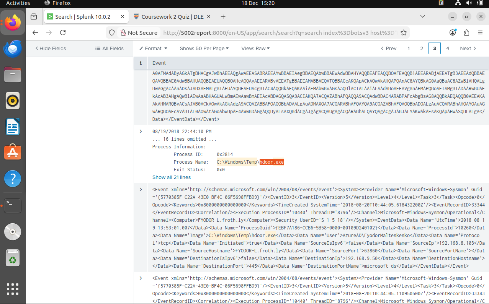
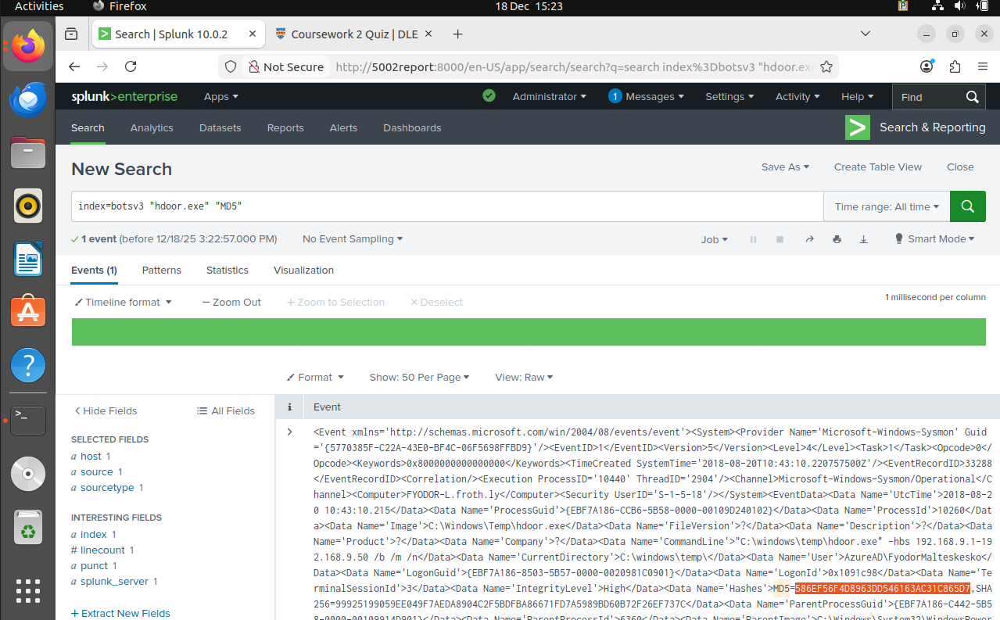

Splunk initialisation

BOTSv3 dataset Downloaded

BOTSv3 dataset ingested

Q1 screenshots:

Q2 Screenshots:

Q3

Q4

Q5

Q6

Q7

Q8

This report details the forensic investigation into a suspected security incident affecting "Frothly," a brewing company. Acting in the capacity of a Security Operations Centre (SOC) analyst, the objective of this task was to establish situational awareness i.e. the real-time perception, comprehension, and projection of cybersecurity events—regarding potential malicious activity within the corporate network.
The investigation was conducted using Splunk Enterprise, a Security Information and Event Management (SIEM) platform, to correlate and analyse telemetry from the BOTSv3 (Boss of the SOC) dataset. This dataset simulates a realistic enterprise environment, containing logs from diverse sources including Windows Event Logs, Sysmon, Osquery, and network stream data.
