# 5002-Report

GitHub Link: https://github.com/RJW543/5002-Report.git
YouTube Link: 
WORD COUNT: 2192/2200 (2000 + 10%)

## Table of Contents

1. [Introduction](#1-introduction)
   - 1.1 [Context and Situational Awareness](#11-context-and-situational-awareness)
   - 1.2 [Incident Management Framework](#12-incident-management-framework)
   - 1.3 [Objectives](#13-objectives)
   - 1.4 [Scope and Assumptions](#14-scope-and-assumptions)
2. [SOC Roles & Incident Handling Reflection](#2-soc-roles--incident-handling-reflection)
   - 2.1 [SOC Structure and Analyst Responsibilities](#21-soc-structure-and-analyst-responsibilities)
   - 2.2 [Incident Handling Methodology](#22-incident-handling-methodology)
3. [Installation & Data Preparation](#3-installation--data-preparation)
   - 3.1 [SOC Infrastructure & Architecture](#31-soc-infrastructure--architecture)
   - 3.2 [Dataset Ingestion Strategy](#32-dataset-ingestion-strategy)
   - 3.3 [Validation & Due Diligence](#33-validation--due-diligence)
   - 3.4 [Challenges & Field Extraction](#34-challenges--field-extraction)
4. [Investigation & Findings](#4-investigation--findings)
   - 4.1 [Question 1: Initial Access (User Agent Identification)](#41-question-1-initial-access-user-agent-identification)
   - 4.2 [Question 2: Delivery Vector (Malicious Attachment)](#42-question-2-delivery-vector-malicious-attachment)
   - 4.3 [Question 3: Installation (Embedded Executable)](#43-question-3-installation-embedded-executable)
   - 4.4 [Question 4: Persistence (Linux Account Creation)](#44-question-4-persistence-linux-account-creation)
   - 4.5 [Question 5: Persistence (Windows Account Creation)](#45-question-5-persistence-windows-account-creation)
   - 4.6 [Question 6: Privilege Escalation (Group Assignments)](#46-question-6-privilege-escalation-group-assignments)
   - 4.7 [Question 7: Command & Control (Backdoor Port)](#47-question-7-command--control-backdoor-port)
   - 4.8 [Question 8: Reconnaissance (Scanning Tool Identification)](#48-question-8-reconnaissance-scanning-tool-identification)
5. [Conclusion & Recommendations](#5-conclusion--recommendations)
   - 5.1 [Incident Summary](#51-incident-summary)
   - 5.2 [Key Lessons & SOC Strategy Implications](#52-key-lessons--soc-strategy-implications)
   - 5.3 [Improvements for Detection and Response](#53-improvements-for-detection-and-response)
6. [References](#6-references)
7. [AI declaration](#7-ai-declaration)

---

## Video Link
https://youtu.be/n4lK84x7n-o

## 1 Introduction

### 1.1 Context and Situational Awareness

This report examines a suspected security incident at Frothly, a brewing company. As a Security Operations Centre (SOC) analyst, I established situational awareness of potential malicious activity within the corporate network by analysing the BOTSv3 (Boss of the SOC) dataset [8] using Splunk Enterprise, a Security Information and Event Management (SIEM) platform. The BOTSv3 dataset simulates a realistic enterprise environment with logs from Windows Event Logs, Sysmon, Osquery, and network stream data.

### 1.2 Incident Management Framework

Following the NCSC Incident Management lifecycle [9] (Identify → Protect → Detect → Respond), this investigation focuses on Detection and Analysis. IOCs were verified through cross-referenced log analysis rather than single data points.

### 1.3 Objectives

The specific objectives of this investigation were to:
- Identify the initial access vector used by the threat actor to infiltrate the network.
- Analyse the behaviour of the intruder, including lateral movement, privilege escalation, and persistence mechanisms.
- Verify IOCs such as malicious file hashes, command and control (C2) traffic, and unauthorised user account creation.
- Formulate evidence-based recommendations to contain the incident and eradicate the threat from the Frothly environment.

[10]

### 1.4 Scope and Assumptions

- **Scope:** The analysis is limited to the telemetry provided in the BOTSv3 dataset, specifically focusing on the timeframe surrounding August 2018, where anomalous activity was detected. Key assets investigated include the workstation FYODOR-L and the Linux server hoth.
- **Assumptions:** It is assumed that the log ingestion is complete for the period of the attack, though potential gaps in specific logging capabilities (e.g., missing Sysmon events for certain actions) were noted and mitigated through pivot analysis. The analysis assumes the role of a Tier 2 SOC Analyst, responsible for deep-dive investigation following initial triage.

## 2 SOC Roles & Incident Handling Reflection

### 2.1 SOC Structure and Analyst Responsibilities

A modern SOC uses tiered roles to manage high-volume security telemetry. The BOTSv3 investigation required shifting between these tiers: 
- **Tier 1 (Triage Specialist):** Filtered high-volume logs to identify genuine anomalies, such as sifting through SMTP streams to locate the "Malware Alert Text.txt" attachment 
- **Tier 2 (Incident Responder):** Conducted deep-dive analysis, correlating data points (e.g., linking excel.exe execution to hdoor.exe creation) to construct the attack timeline 
- **Tier 3 (Threat Hunter):** When automated alerts failed (missing Sysmon EventCode 11 for file creation), employed proactive hunting by searching C:\Windows\Temp*.exe, successfully uncovering embedded malware in temporary directories (Figure 1) 


Figure 1 - Proactive threat hunting (Tier 3) identifying malicious binaries in temporary directories.

### 2.2 Incident Handling Methodology

Following the NCSC Incident Management framework [9] (Identify → Protect → Detect → Respond), the Frothly incident analysis reveals:

**Prevention & Protection (Failure Analysis)**

The macro-enabled spreadsheet (Frothly-Brewery-Financial-Planning-FY2019-Draft.xlsm) executed successfully, indicating inadequate endpoint security and email filtering failures.

**Detection & Analysis**

Detection identified abnormal network and endpoint behavior:
- **Network Artifacts:** HxTsr.exe communications revealed the C2 channel
- **Endpoint Artifacts:** EventCode 4720 [11] and 4732 [12] showed backdoor account svcvnc creation and Administrators group elevation

**Response (Containment & Eradication)**

Live response requires isolating FYODOR-L and hoth, blocking C2 traffic (port 1337), and eradicating persistence (disable svcvnc/tomcat7 accounts; remove malicious binaries).

**Recovery & Post-Incident Activity**

Compromised hosts should be reimaged rather than cleaned [9], as persistence mechanisms (scheduled tasks, registry keys) are difficult to fully remove. The organization must enforce "block all macros except digitally signed" policies to prevent recurrence.

## 3 Installation & Data Preparation

### 3.1 SOC Infrastructure & Architecture

The forensic environment simulated a SOC Analyst Workstation:
- **SIEM Platform:** Splunk Enterprise 8.x on virtualised Kali Linux
- **Dataset:** BOTSv3 containing pre-indexed telemetry from Frothly's simulated corporate network

**Justification:** Splunk's ability to ingest, index, and correlate unstructured machine data in real-time supports the NCSC Detect phase by enabling cross-layer correlation (e.g., linking network streams to process execution), which is impossible when analysing logs in isolation.

### 3.2 Dataset Ingestion Strategy

The BOTSv3 dataset was ingested using a pre-indexed app to ensure data integrity and query performance: 
1. **Installation:** The BOTSv3 app was installed via Splunk Web Interface (Manage Apps > Install app from file), preserving original timestamps, sourcetypes, and host extractions 
2. **Index Segregation:** All data was confined to index=botsv3, mirroring production SOC environments where investigation data is segregated to prevent cross-contamination and optimise search performance


Figure 2 - BOTSv3 downloaded

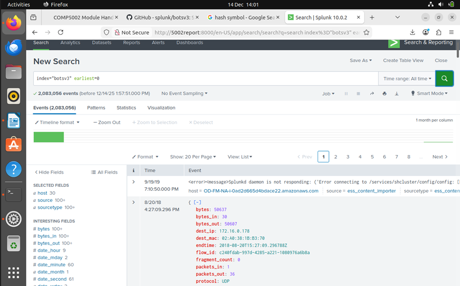

Figure 3 - BOTSv3 ingested

### 3.3 Validation & Due Diligence

Prior to investigation, the dataset was verified to ensure completeness and prevent false negatives from logging gaps. 

**Validation Steps Taken:**
- **Sourcetype Verification:** Query index=botsv3 | stats count by sourcetype confirmed presence of critical log sources: XmlWinEventLog:Microsoft-Windows-Sysmon/Operational (endpoint visibility), stream:http (network visibility), and osquery:results (Linux visibility)
- **Timeframe Normalisation:** Event timeline analysis identified a distinct activity cluster in August 2018, establishing the incident window and filtering background noise


Figure 4 - OneDrive activity distribution from Office 365 logs showing FileAccessed (760 events) as the dominant operation type, confirming cloud telemetry ingestion.

### 3.4 Challenges & Field Extraction

Certain Splunk field extractions were inconsistent (e.g., DestinationPort in Sysmon EventCode 3 not automatically parsed), risking missed evidence. To mitigate this, the investigation employed Tier 3 Threat Hunting methodology, augmenting structured field searches with raw text searching (e.g., term("1337")) and regex-based extraction to ensure complete artifact discovery despite parsing failures. 

## 4 Investigation & Findings

This section details the forensic analysis conducted to answer the guided investigation questions (BOTSv3 300-level). Each finding is supported by a documented methodology, specific Splunk queries, and verified evidence. 

### 4.1 Question 1: Initial Access (User Agent Identification)

**Objective:** Identify the User Agent string used by the attacker to upload the malicious document to the organisation's OneDrive storage.

**Methodology:**

The investigation began by analysing Cloud audit logs (ms:o365:management) to identify file upload events (Workload=OneDrive) related to the known malicious file. Once the specific upload event was isolated, the UserAgent field was examined to determine the source software used by the attacker. This distinguishes between legitimate browser-based uploads and automated scripts or non-standard clients.

**Splunk Query:**
```spl
index=botsv3 sourcetype="ms:o365:management" Workload=OneDrive 
| stats count by Operation
| sort - count

index="botsv3" sourcetype="ms:o365:management" Workload=OneDrive
| spath
| search Operation=FileUploaded
| eval filename=coalesce(SourceFileName, Filename, ObjectId, ItemName)
| where match (filename, "\.lnk$")
|  table _time UserId ClientIP Operation filename UserAgent
| sort 0 - _time

index="botsv3" sourcetype="ms:o365:management" Workload=OneDrive
| spath
| eval filename=coalesce(SourceFileName, Filename, ObjectId, ItemName)
| where match (filename, "\.lnk$")
| eval ua=mvindex(UserAgent, 0)
| table _time UserID ClientIP filename ua
```

**Evidence:**


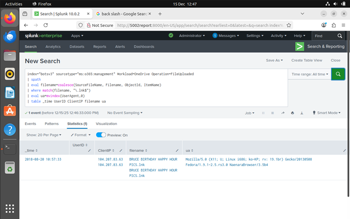

Figure 5 - Office 365 logs revealing the attacker's User Agent string.

**SOC Relevance:**

User Agent analysis is a key component of "Situational Awareness". Identifying a non-standard or Linux-based User Agent (e.g., Mozilla/5.0...Linux...) accessing corporate OneDrive accounts is a high-fidelity Indicator of Compromise (IOC) that can be used to create detection rules for future anomalies.

**Answer:** Mozilla/5.0 (X11; U; Linux i686; ko-KP; rv: 19.1br) Gecko/20130508 Fedora/1.9.1–2.5.rs3.0 NaenaraBrowser/3.5b4

### 4.2 Question 2: Delivery Vector (Malicious Attachment)

**Objective:** Identify the malicious email attachment responsible for delivering the initial payload, using telemetry that records email/attachment metadata and contents. 

**Methodology:**

Pivoted to email telemetry (stream:smtp), filtering for the attachment "Malware Alert Text.txt". After normalising the raw event for reliable regex extraction, I used rex to extract MIME filenames and hunt for macro-enabled extensions (.xlsm). The document name was confirmed by Base64-decoding the attachment externally (Figure 6).

**Splunk Query:**
```spl
index=botsv3 sourcetype="stream:smtp"
| eval raw2=raw
| eval raw2=replace(raw2,"=3D","=")
| eval raw2=replace(raw2,"\\\n","")
| eval raw2=replace(raw2,"=\r?\n","")
| rex field=raw2 "(?i)bfilename=\"(?<attachment>[^\"]+)\""
| search attachment="Malware Alert Text.txt"
| rex max_match=0 field=raw2 "(?i)(?<macro_file>[A-Za-z0-9][A-Za-z0-9_.-]{0,200}\.(?:docm|dotm|xlsm|xltm|pptm|potm|ppsm|sldm|ppam|doc|dot|xls|xlt|ppt|pot|pps))"
| mvexpand macro_file
| table _time attachment macro_file

index=botsv3 sourcetype="stream:smtp" "Malware Alert Text.txt"
```

**Evidence:**

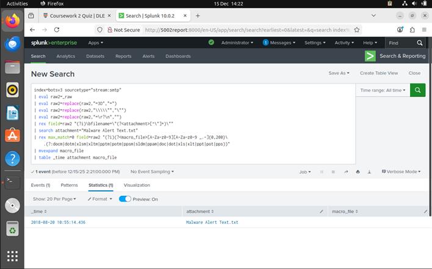
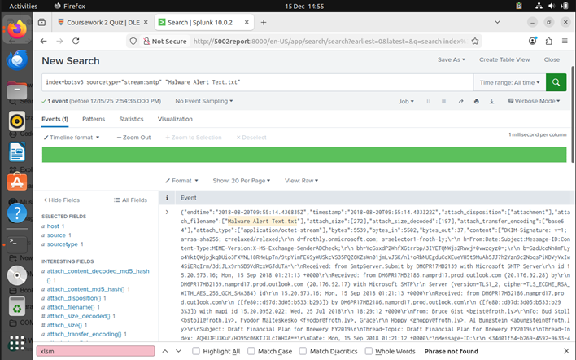
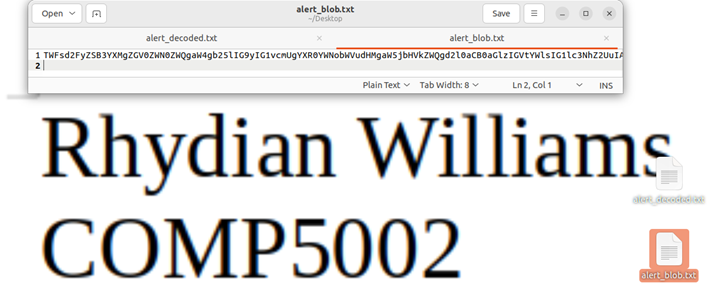
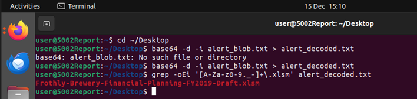

Figure 6 – shows the email/attachment search returning the macro-enabled document name from within the alert text.

**SOC Relevance:**

- **Email triage & rapid containment:** Identifying the exact malicious attachment (Malware Alert Text.txt) and the referenced macro-enabled document (Frothly-Brewery-Financial-Planning-FY2019-Draft.xlsm) lets the SOC immediately scope impact (who received it, who opened it) and take containment actions such as quarantining the message, blocking sender/domain, and purging the attachment from mailboxes.
- **Detection engineering:** The presence of a macro-enabled Office file extension (.xlsm) is a high-signal indicator for phishing/malspam. SOC teams can build detections on:
  - inbound emails with macro-enabled attachments,
  - suspicious attachment names/subjects,
  - Base64/MIME patterns linked to embedded content.
- **User awareness & reporting:** Clear identification of the "what" and "how" supports user comms ("Do not open X / report emails containing Y"), improving organisational resilience and reducing dwell time.

**Answer:** Frothly-Brewery-Financial-Planning-FY2019-Draft.xlsm

### 4.3 Question 3: Installation (Embedded Executable)

**Objective:** Determine the name of the executable embedded/dropped by the malware originating from the malicious Excel macro document. 

**Methodology:**

1. Initial Sysmon EventCode=11 queries for Excel-dropped executables returned no results, necessitating a broader pivot. 
2. Pivoted to a more generic dataset-wide approach by enumerating executables observed in the environment using the pn (process name) field.
3. Counted all *.exe values in pn to identify suspicious/standout executables.
4. Identified HxTsr.exe as a high-signal, unusual executable name.
5. Confirmed by searching directly for pn="HxTsr.exe" and reviewing returned events to validate it was active on the compromised endpoint during the compromise window (as shown in Figure 7).
6. Based on that pivot + confirmation, concluded the embedded/dropped payload executable name was HxTsr.exe.

**Splunk Queries:**
```spl
index=botsv3 sourcetype="XmlWinEventLog:Microsoft-Windows-Sysmon/Operational" EventCode=11 Image="*excel.exe*" TargetFilename="*.exe"

index=botsv3 pn=*.exe | stats count by pn

index=botsv3 pn="HxTsr.exe"
```

**Evidence:**

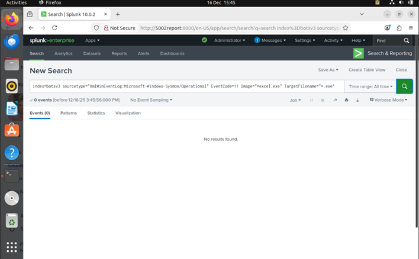
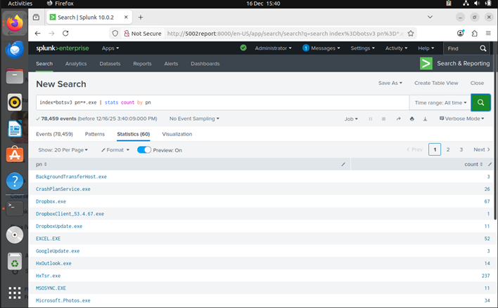
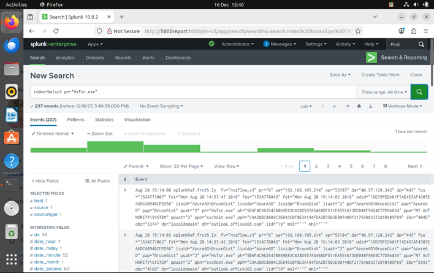

Figure 7 

Figure 7 shows:
- The Sysmon-based attempt returning no results (justifying the pivot).
- The pn=*.exe | stats count by pn enumeration where HxTsr.exe appears as a standout executable.
- The focused search pn="HxTsr.exe" showing the supporting events that confirm it is present/active on the compromised endpoint.

**SOC Relevance:**

- **Endpoint containment & scoping:** Knowing the dropped/embedded payload name (HxTsr.exe) gives the SOC a concrete pivot for endpoint response: isolate affected hosts, collect file artefacts, check persistence mechanisms, and identify lateral movement from processes spawned by that executable.
- **IOC-driven detection:** The payload name enables EDR/SIEM detections on process execution, parent-child relationships (Office → payload), and command-line patterns.
- **Kill chain linkage:** Mapping "macro doc → dropped EXE" helps analysts document and prove the attack chain (initial access → execution → payload deployment), which is essential for incident reporting, timeline building, and eradication planning.
- **Hardening & prevention:** This finding supports preventative controls such as blocking Office macro execution from the internet, tightening application allowlisting, and enforcing ASR rules (e.g., blocking Office from creating child processes) to prevent the same technique from succeeding again.

**Answer:** HxTsr.exe

### 4.4 Question 4: Persistence (Linux Account Creation)

**Objective:** Identify the password for the backdoor user account created by the root user on the Linux server hoth. 

**Methodology:**

The investigation shifted to the Linux endpoint hoth, utilising Osquery logs to inspect command-line execution history. A search for account creation commands (useradd OR adduser) filtered by the root user revealed a command where the attacker inadvertently passed the password in plain text using the -p flag. The command revealed the creation of user account tomcat7 with the plain-text password passed via the -p flag.

**Splunk Query:**
```spl
index=botsv3 host="hoth" useradd
```

**Evidence:**
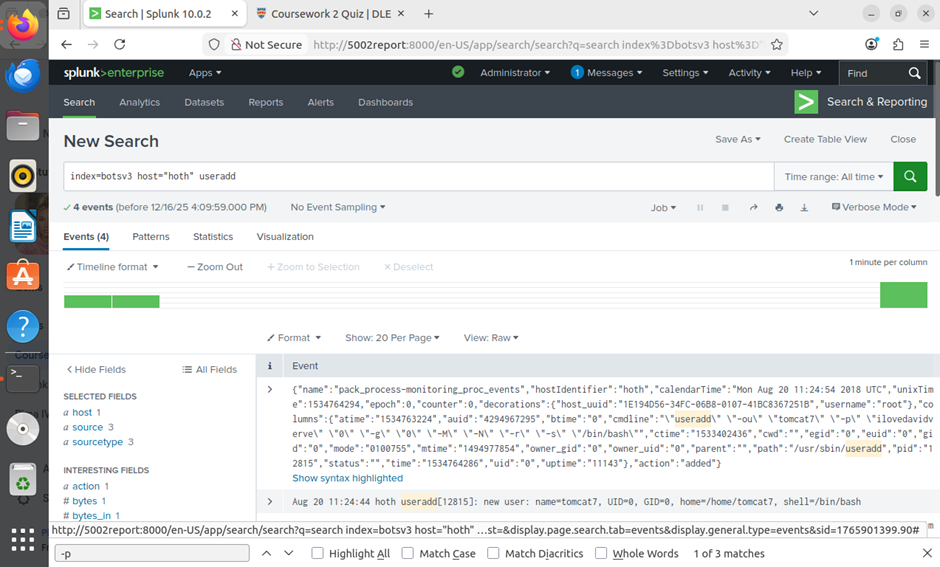

Figure 8 - Osquery logs capturing the plain-text password in the command line arguments.

**SOC Relevance:**

Capturing the password (ilovedavidverve) allows the SOC to check if this credential has been reused on other compromised systems (Credential Stuffing). It also highlights a critical OPSEC failure by the attacker and a training need for administrators regarding secure command-line practices.

**Answer:** ilovedavidverve

### 4.5 Question 5: Persistence (Windows Account Creation)

**Objective:** Identify the name of the user account created on the compromised Windows endpoint to establish persistence. 

**Methodology:**

Following the confirmation of the beaconing activity, the investigation focused on host-based persistence mechanisms. I queried the Windows Security Event Logs for Event Code 4720 ("A user account was created"). This search identified the anomalous creation of the user svcvnc by the compromised account FyodorMalteskesko.

**Splunk Query:**
```spl
index=botsv3 sourcetype="WinEventLog:Security" EventCode=4720
```

**Evidence:**

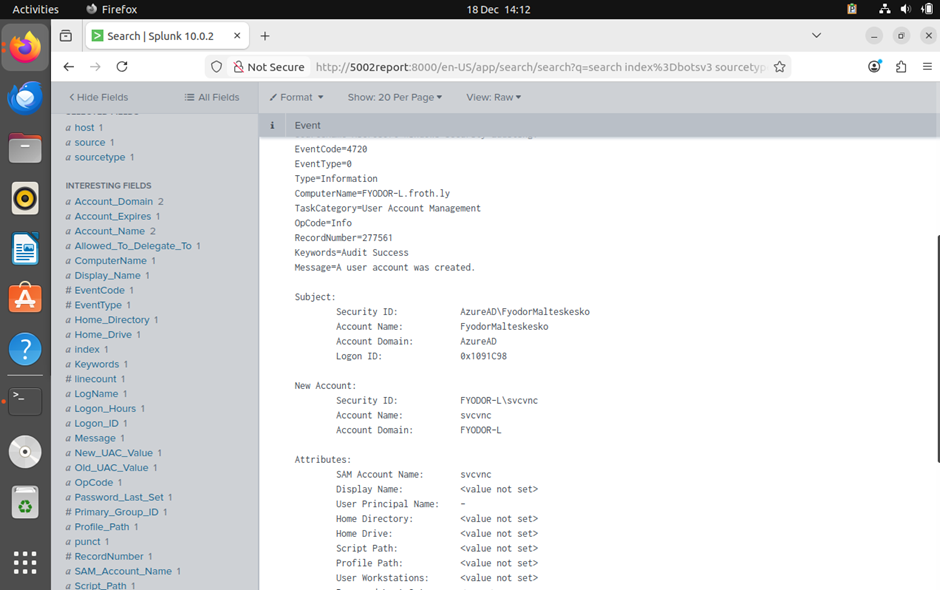

Figure 9 - Windows Security Log (Event 4720) showing the creation of the unauthorised user "svcvnc".

**SOC Relevance:**

The username svcvnc attempts to masquerade as a legitimate "Service VNC" account. Identifying this account allows the SOC to audit all actions performed by this specific Security ID (SID) to determine the full scope of lateral movement and data exfiltration.

**Answer:** svcvnc

### 4.6 Question 6: Privilege Escalation (Group Assignments)

**Objective:** To identify the specific local groups the compromised user svcvnc was added to, indicating the level of privilege the attacker achieved. 

**Methodology:**

To determine the extent of the compromise, the investigation focused on Privilege Escalation (MITRE ATT&CK T1098). I queried the Windows Security Event Logs for Event Code 4732 ("A member was added to a security-enabled local group"). I filtered specifically for the user svcvnc to track group membership changes. The analysis revealed two distinct events where the user was added to the Users group (default) and, critically, the Administrators group.

**Splunk Query:**
```spl
index=botsv3 sourcetype="WinEventLog:Security" EventCode=4732 "svcvnc"
```

**Evidence:**
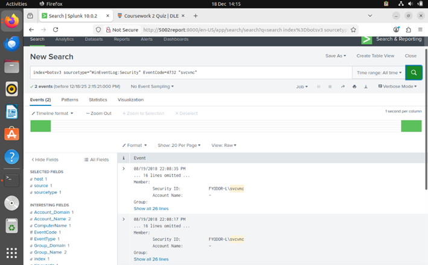
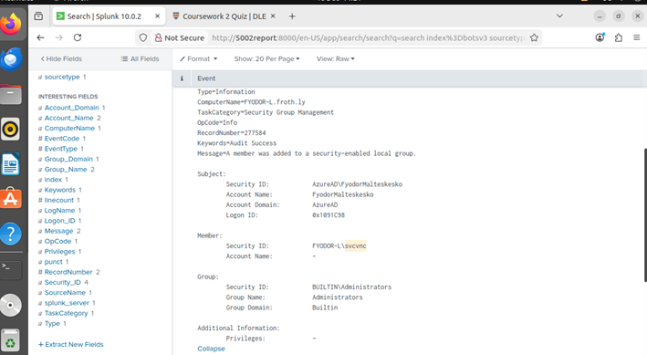
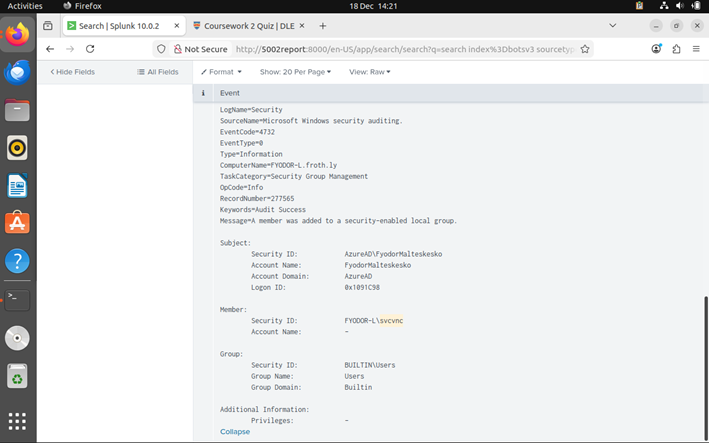

Figure 10 - Windows Security Log (Event 4732) confirming 'svcvnc' was added to the built-in Administrators group.

**SOC Relevance:**

The addition of a user to the Administrators group is a critical severity event ("Game Over"). 
- **Impact:** It indicates the attacker has achieved full system control, allowing them to disable antivirus, wipe logs, install rootkits, or dump credentials (e.g., Mimikatz).
- **Response:** This triggers an immediate Tier 1 escalation. The machine must be taken offline and is generally considered untrusted/unrecoverable without a full re-image.

**Answer:** Administrators,User

### 4.7 Question 7: Command & Control (Backdoor Port)

**Objective:** Determine the Process ID (PID) of the malicious process listening on the non-standard "leet" port (1337) on the Linux server. 

**Methodology:**

To verify the active backdoor on the Linux host hoth, I utilised Osquery data, specifically the listening_ports table. I searched for local connections on port 1337 (a common "leet" speak reference). This allowed me to map the open network port directly to the specific process ID responsible for the connection.

**Splunk Query:**
```spl
index=botsv3 host="hoth" 1337
```

**Evidence:**


Figure 11 - Osquery results linking Port 1337 to Process ID 14356.

**SOC Relevance:**

Correlating network ports to Process IDs is a fundamental SOC skill. While a firewall log shows a connection, it does not identify the cause. By pivoting to Osquery, we confirmed that the open port was not a misconfigured service but a specific malicious process (likely netcat), necessitating immediate termination of that PID.

**Answer:** 14356

### 4.8 Question 8: Reconnaissance (Scanning Tool Identification)

**Objective:** Identify the MD5 hash of the file downloaded to FYODOR-L and used to scan the Frothly network. 

**Methodology:**

- **Phase 1 (Threat Hunting):** Initial network analysis indicated scanning behaviour, but specific attribution was difficult. I pivoted to a file-system hunt, hypothesising that attackers often execute tools from temporary directories to bypass permissions. A search for executables in C:\Windows\Temp identified the suspicious binary hdoor.exe.
- **Phase 2 (Verification):** To generate a verifiable IOC, I searched for the Sysmon "Process Create" event (Event Code 1) for this file, which contains the cryptographic hash.

**Splunk Query:**
```spl
index=botsv3 host="FYODOR-L" "C:\\Windows\\Temp" ".exe"

index=botsv3 "hdoor.exe" "MD5"
```

**Evidence:**

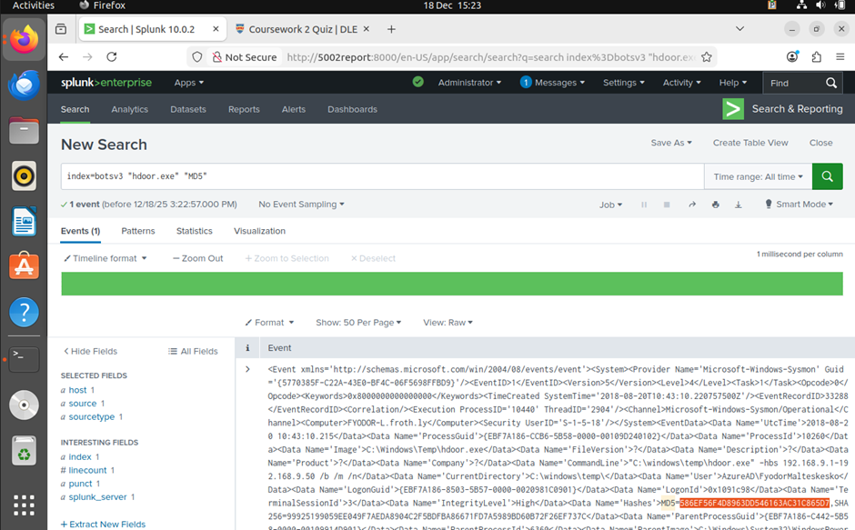

Figure 12 - Sysmon Event Code 1 confirming the execution of "hdoor.exe" from the Temp directory and revealing its MD5 hash.

**SOC Relevance:**

Collecting the MD5 hash (586...5D7) allows the SOC to implement the Protect phase. This hash can be added to EDR blocklists to neutralise the tool across the entire enterprise, even if the attacker renames the file to evade detection.

**Answer:** 586EF56F4D8963DD546163AC31C865D7

## 5 Conclusion & Recommendations

### 5.1 Incident Summary

The BOTSv3 investigation confirmed a multi-stage intrusion with clear attack progression:
1. **Initial Access:** Spear-phishing delivered macro-enabled Excel document (Frothly-Brewery-Financial-Planning-FY2019-Draft.xlsm)
2. **Execution & Installation:** Macro dropped HxTsr.exe and hdoor.exe into C:\Windows\Temp to bypass permission checks
3. **Persistence & Privilege Escalation:** Established persistence via svcvnc (Windows) and tomcat7 (Linux) accounts
4. **Command & Control:** Backdoor on server hoth using port 1337 netcat listener

### 5.2 Key Lessons & SOC Strategy Implications

The incident highlights critical "Protect" phase gaps. While "Detect" capabilities (Splunk, Osquery, Sysmon) enabled retroactive investigation, lack of proactive blocking allowed attack success.

**Strategic Implications:**
- **Situational Awareness:** SOC lacked real-time alerting for high-fidelity IOCs (useradd by root, EventCode 4720 on workstations)
- **Defense in Depth:** Unsigned macro execution indicates endpoint hardening failures requiring "Prevention-first" strategies

### 5.3 Improvements for Detection and Response

Recommended improvements aligned with the incident lifecycle:

**Protect (Hardening):**
- Enforce GPO to block macros in Office documents from the internet
- Implement AppLocker to prevent binary execution from C:\Windows\Temp and %APPDATA%

**Detect (SIEM Tuning):**
- Alert on HxTsr.exe, svchost.exe, or explorer.exe with parent process excel.exe or winword.exe
- High-severity alert for EventCode 4732 on non-Domain Controller endpoints

**Respond (Playbooks):**
- Automated isolation playbook to quarantine endpoints with C2 behavior (e.g., outbound port 1337)

## 6 References

1. J. Chin, COMP5002 Module Handbook, University of Plymouth, 2025.
2. J. Chin, "Lecture 01: Introduction to Situational Awareness," University of Plymouth, 2025.
3. J. Chin, "Lecture 02: IDS and Prevention," University of Plymouth, 2025.
4. J. Chin, "Lecture 03: Intruder Behaviour & TCP Basics," University of Plymouth, 2025.
5. J. Chin, "Lecture 06: Network Traffic Analysis," University of Plymouth, 2025.
6. J. Chin, "Lecture 09: Security Information and Event Management (SIEM)," University of Plymouth, 2025.
7. J. Chin, "Lecture 11: Incident Handling," University of Plymouth, 2025.
8. Splunk Inc., "Boss of the SOC (BOTSv3) Dataset," 2018. [Online]. Available: https://github.com/splunk/botsv3.
9. NCSC, "Incident management," ncsc.gov.uk, 2020. https://www.ncsc.gov.uk/collection/incident-management
10. A. Nelson, S. Rekhi, M. Souppaya, and K. Scarfone, "Incident Response Recommendations and Considerations for Cybersecurity Risk Management":, NIST, Apr. 2025, doi: https://doi.org/10.6028/nist.sp.800-61r3.
11. vinaypamnani-msft, "4720(S) A user account was created. - Windows 10," learn.microsoft.com, Sep. 07, 2021. https://learn.microsoft.com/en-us/previous-versions/windows/it-pro/windows-10/security/threat-protection/auditing/event-4720
12. vinaypamnani-msft, "4732(S) A member was added to a security-enabled local group. - Windows 10," learn.microsoft.com, Sep. 07, 2021. https://learn.microsoft.com/en-us/previous-versions/windows/it-pro/windows-10/security/threat-protection/auditing/event-4732

