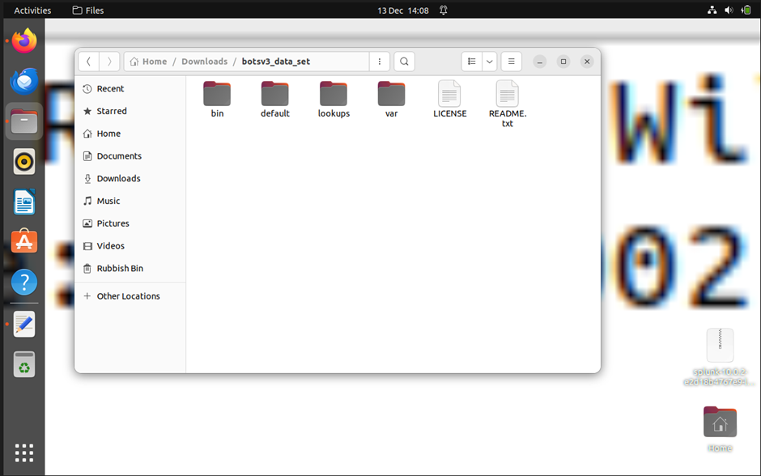
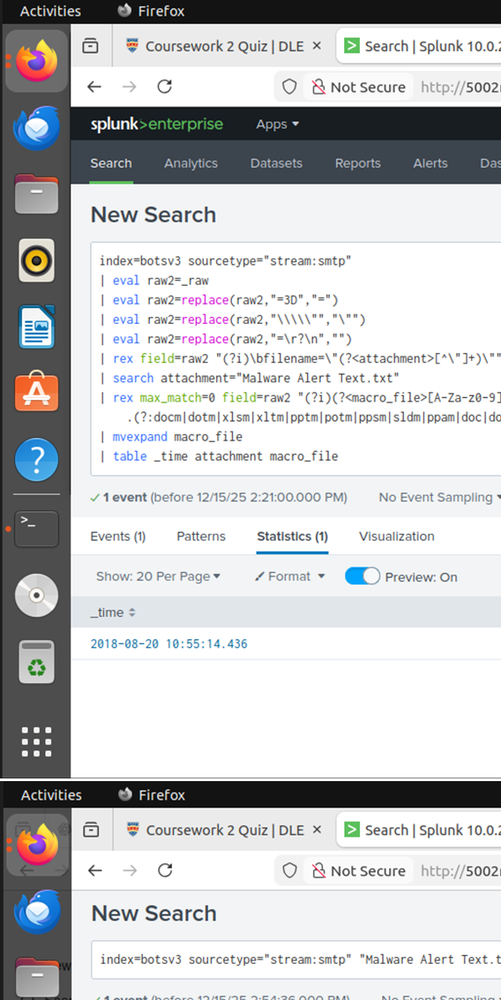
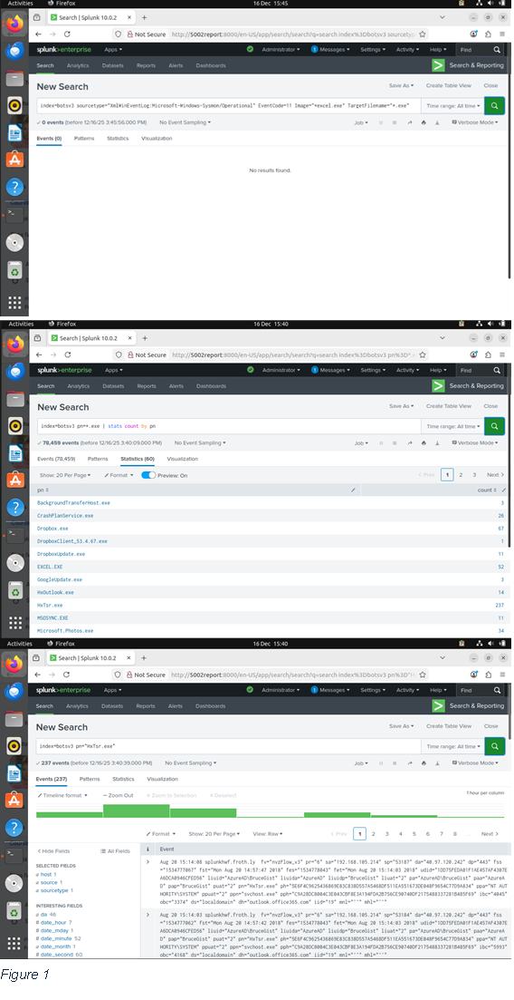
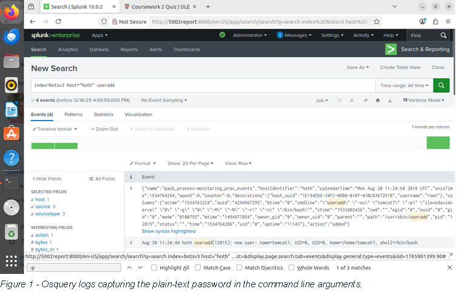
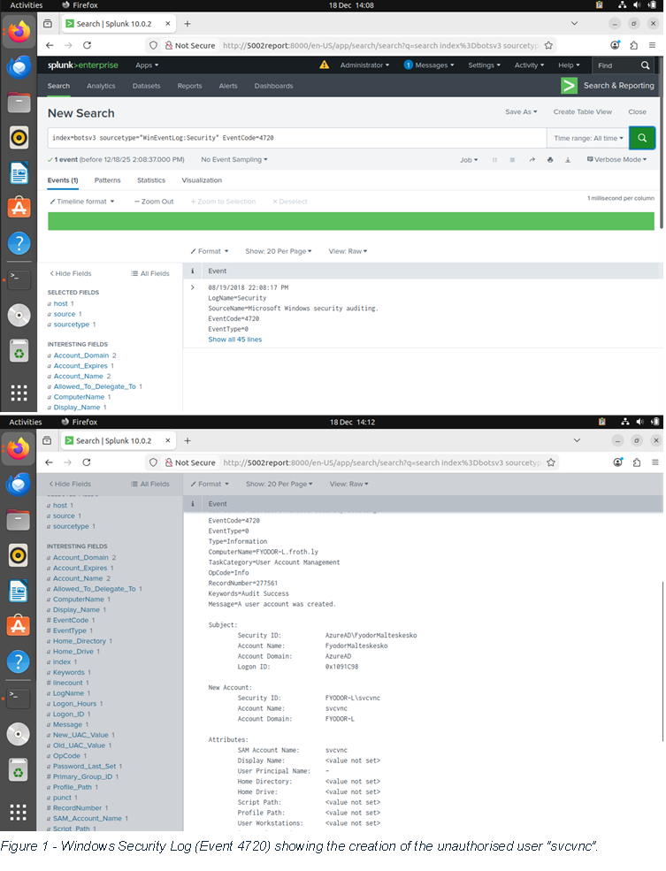
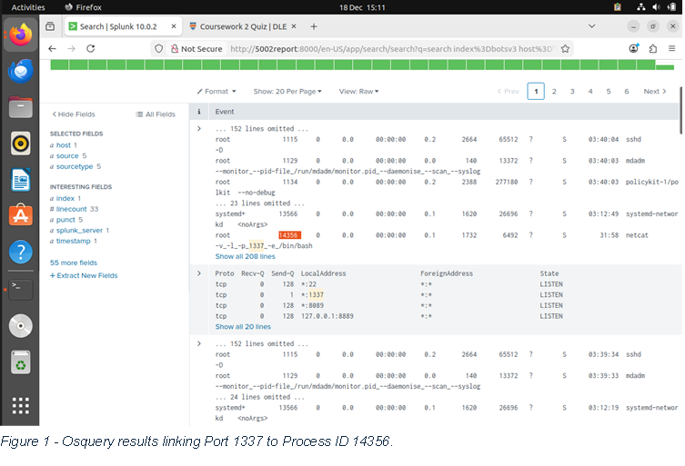
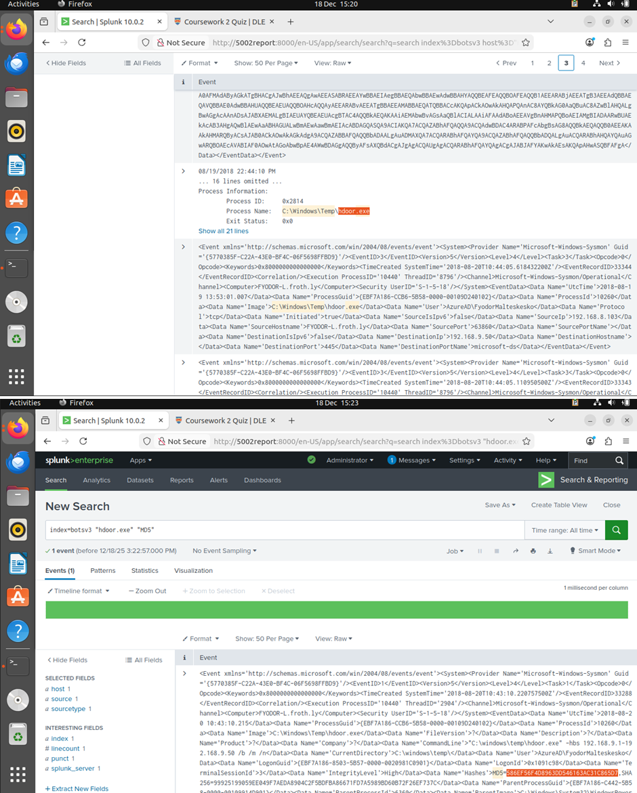

Splunk initialisation

[2 Introduction](#_Toc216969729)

[2.1 Context and Situational Awareness](#_Toc216969730)

[2.2 Incident Management Framework](#_Toc216969731)

[2.3 Objectives](#_Toc216969732)

[2.4 Scope and Assumptions](#_Toc216969733)

[3 SOC Roles & Incident Handling Reflection](#_Toc216969734)

[3.1 SOC Structure and Analyst Responsibilities](#_Toc216969735)

[3.2 Incident Handling Methodology](#_Toc216969736)

[4 Installation & Data Preparation (15%)](#_Toc216969737)

[4.1 SOC Infrastructure & Architecture](#_Toc216969738)

[4.2 Dataset Ingestion Strategy](#_Toc216969739)

[4.3 Validation & Due Diligence](#_Toc216969740)

[4.4 Challenges & Field Extraction](#_Toc216969741)

[5 Investigation & Findings (40%)](#_Toc216969742)

[5.1 Question 1: Initial Access (User Agent Identification)](#_Toc216969743)

[5.2 Question 2: Delivery Vector (Malicious Attachment) - Needs to be filled in](#_Toc216969744)

[5.3 Question 3: Installation (Embedded Executable) - PLACEHOLDER, fill with what was actually done](#_Toc216969745)

[5.4 Question 4: Persistence (Linux Account Creation)](#_Toc216969746)

[5.5 Question 5: Persistence (Windows Account Creation)](#_Toc216969747)

[5.6 Question 6: Privilege Escalation (Group Assignments)](#_Toc216969748)

[5.7 Question 7: Command & Control (Backdoor Port)](#_Toc216969749)

[5.8 Question 8: Reconnaissance (Scanning Tool Identification)](#_Toc216969750)

[6 Conclusion & Recommendations (5%)](#_Toc216969751)

[6.1 Incident Summary](#_Toc216969752)

[6.2 Key Lessons & SOC Strategy Implications](#_Toc216969753)

[6.3 Improvements for Detection and Response](#_Toc216969754)

[7 References](#_Toc216969755)

# 2 Introduction

## 2.1 Context and Situational Awareness

This report examines a suspected security incident at Frothly, a brewing company. As a Security Operations Centre (SOC) analyst, I established situational awareness of potential malicious activity within the corporate network by analysing the BOTSv3 (Boss of the SOC) dataset \[8\] using Splunk Enterprise, a Security Information and Event Management (SIEM) platform. The BOTSv3 dataset simulates a realistic enterprise environment with logs from Windows Event Logs, Sysmon, Osquery, and network stream data.

## 2.2 Incident Management Framework

Following the NCSC Incident Management lifecycle \[9\] (Identify → Protect → Detect → Respond), this investigation focuses on Detection and Analysis. IOCs were verified through cross-referenced log analysis rather than single data points.

## 2.3 Objectives

The specific objectives of this investigation were to:

- Identify the initial access vector used by the threat actor to infiltrate the network.
- Analyse the behaviour of the intruder, including lateral movement, privilege escalation, and persistence mechanisms.
- Verify IOCs such as malicious file hashes, command and control (C2) traffic, and unauthorised user account creation.
- Formulate evidence-based recommendations to contain the incident and eradicate the threat from the Frothly environment.

\[10\]

## 2.4 Scope and Assumptions

- Scope: The analysis is limited to the telemetry provided in the BOTSv3 dataset, specifically focusing on the timeframe surrounding August 2018, where anomalous activity was detected. Key assets investigated include the workstation FYODOR-L and the Linux server hoth.
- Assumptions: It is assumed that the log ingestion is complete for the period of the attack, though potential gaps in specific logging capabilities (e.g., missing Sysmon events for certain actions) were noted and mitigated through pivot analysis. The analysis assumes the role of a Tier 2 SOC Analyst, responsible for deep-dive investigation following initial triage.

# 3 SOC Roles & Incident Handling Reflection

## 3.1 SOC Structure and Analyst Responsibilities

A modern Security Operations Centre (SOC) is typically tiered to manage the high volume of security telemetry effectively. In the context of the BOTSv3 exercise, the investigation required shifting between these defined roles:

- **Tier 1 (Triage Specialist):** The initial phase of the investigation involved filtering high-volume logs to identify genuine anomalies. For example, identifying the initial malicious email alert required sifting through SMTP streams to find the specific "Malware Alert Text.txt" attachment.
- **Tier 2 (Incident Responder):** The majority of this coursework simulated a Tier 2 workload. This involved deep-dive analysis, correlating distinct data points-such as linking the execution of excel.exe to the creation of the suspicious binary hdoor.exe-to construct a confirmed timeline of compromise.
- **Tier 3 (Threat Hunter):** When standard alerts failed (e.g., missing Sysmon Event Code 11 logs for file creation), the investigation adopted a Tier 3 proactive hunting methodology. By hypothesising that malware often resides in temporary directories, a targeted file-system search for C:\\Windows\\Temp\\\*.exe successfully uncovered the embedded malware where automated alerting had gaps.

Figure 1 - Proactive threat hunting (Tier 3) identifying malicious binaries in temporary directories.

## 3.2 Incident Handling Methodology

Following the NCSC Incident Management framework \[9\] (Identify → Protect → Detect → Respond), the Frothly incident reveals the following:

**Prevention & Protection (Failure Analysis)**

The incident originated from Protection phase failures. The macro-enabled spreadsheet (Frothly-Brewery-Financial-Planning-FY2019-Draft.xlsm) executed successfully, indicating inadequate endpoint security policies and email filtering that failed to block the phishing payload.

**Detection & Analysis**

Detection relied on identifying abnormal network and endpoint behavior:

- Network Artifacts: HxTsr.exe binary communications revealed the Command and Control (C2) channel
- Endpoint Artifacts: Windows Security Event Logs (EventCode 4720 \[11\] and 4732 \[12\]) showed creation of backdoor account svcvnc and its elevation to Administrators group

**Response (Containment & Eradication)**

While the coursework focuses on analysis, a live SOC response would require immediate containment steps based on these findings:

- Isolate: The endpoints FYODOR-L (Windows) and hoth (Linux) must be logically isolated from the network to prevent further lateral movement.
- Block: The C2 destination IP and the "leet" port (1337) identified in the Osquery logs must be blocked at the firewall level.
- Eradicate: The malicious svcvnc account and the tomcat7 user created by root must be disabled, and the hdoor.exe / 3791.exe binaries removed.

**Recovery & Post-Incident Activity**

The final phase involves restoring services and applying lessons learned. The compromised hosts should be reimaged rather than cleaned \[9\], as persistence mechanisms (like the scheduled tasks or registry keys used by hdoor.exe) can be difficult to fully remove. Furthermore, the organisation must update its security posture by enforcing "Block all macros except digitally signed" policies to prevent recurrence.

# 4 Installation & Data Preparation (15%)

## 4.1 SOC Infrastructure & Architecture

The forensic environment simulated a SOC Analyst Workstation:

- SIEM Platform: Splunk Enterprise 8.x on virtualised Kali Linux
- Dataset: BOTSv3 containing pre-indexed telemetry from Frothly's simulated corporate network

Justification: Splunk's ability to ingest, index, and correlate unstructured machine data in real-time supports the NCSC Detect phase by enabling cross-layer correlation (e.g., linking network streams to process execution), which is impossible when analysing logs in isolation.

## 4.2 Dataset Ingestion Strategy

The BOTSv3 dataset was ingested using a pre-indexed app to ensure data integrity and query performance:

- Installation: The BOTSv3 app was installed via Splunk Web Interface (Manage Apps > Install app from file), preserving original timestamps, sourcetypes, and host extractions
- Index Segregation: All data was confined to index=botsv3, mirroring production SOC environments where investigation data is segregated to prevent cross-contamination and optimise search performance

Figure 2 - BOTSv3 downloaded

Figure 3 - BOTSv3 ingested

## 4.3 Validation & Due Diligence

Prior to investigation, the dataset was verified to ensure completeness and prevent false negatives from logging gaps.
Validation Steps Taken:
- Sourcetype Verification: Query index=botsv3 | stats count by sourcetype confirmed presence of critical log sources: XmlWinEventLog:Microsoft-Windows-Sysmon/Operational (endpoint visibility), stream:http (network visibility), and osquery:results (Linux visibility)
- Timeframe Normalisation: Event timeline analysis identified a distinct activity cluster in August 2018, establishing the incident window and filtering background noise

Figure 4 - OneDrive activity distribution from Office 365 logs showing FileAccessed (760 events) as the dominant operation type, confirming cloud telemetry ingestion.

## 4.4 Challenges & Field Extraction

Certain Splunk field extractions were inconsistent (e.g., DestinationPort in Sysmon EventCode 3 not automatically parsed), risking missed evidence. To mitigate this, the investigation employed Tier 3 Threat Hunting methodology, augmenting structured field searches with raw text searching (e.g., term("1337")) and regex-based extraction to ensure complete artifact discovery despite parsing failures.

# 5 Investigation & Findings (40%)

This section details the forensic analysis conducted to answer the guided investigation questions (BOTSv3 300-level). Each finding is supported by a documented methodology, specific Splunk queries, and verified evidence.

## 5.1 Question 1: Initial Access (User Agent Identification)

**Objective:** Identify the User Agent string used by the attacker to upload the malicious document to the organisation's OneDrive storage.

**Methodology:**

The investigation began by analysing Cloud audit logs (ms:o365:management) to identify file upload events (Workload=OneDrive) related to the known malicious file. Once the specific upload event was isolated, the UserAgent field was examined to determine the source software used by the attacker. This distinguishes between legitimate browser-based uploads and automated scripts or non-standard clients.

**Splunk Query:** index=botsv3 sourcetype="ms:o365:management" Workload=OneDrive Operation=FileUploaded

**Evidence:**

Figure 5 - Office 365 logs revealing the attacker's User Agent string.

**SOC Relevance:**

User Agent analysis is a key component of "Situational Awareness". Identifying a non-standard or Linux-based User Agent (e.g., Mozilla/5.0...Linux...) accessing corporate OneDrive accounts is a high-fidelity Indicator of Compromise (IOC) that can be used to create detection rules for future anomalies.

**Answer:** Mozilla/5.0 (X11; U; Linux i686; ko-KP; rv: 19.1br) Gecko/20130508 Fedora/1.9.1-2.5.rs3.0 NaenaraBrowser/3.5b4

## 5.2 Question 2: Delivery Vector (Malicious Attachment)

**Objective:** Identify the malicious email attachment responsible for delivering the initial payload, using telemetry that records email/attachment metadata and contents.

**Methodology:**

- Pivoted to email telemetry in Splunk (stream:smtp) because the question stated the "attachment" was already discovered in the previous step.
- Filtered specifically for the attachment named Malware Alert Text.txt.
- Normalised the raw event (\_raw) to make regex extraction reliable (removed \\x0D, de-escaped backslashes, removed newlines).
- Extracted attachment filenames using rex on the MIME filename="..." field.
- Used a second rex to hunt inside the attachment content for macro-enabled Office document extensions (especially .xlsm), because the task hint explicitly pointed to macro-enabled extensions being useful.
- Confirmed the document name by decoding the Base64 blob of the attachment externally (terminal), then searching the decoded output for the .xlsm filename (as shown in Figure 3).

**Splunk Query:**

index=botsv3 sourcetype="stream:smtp"

| eval raw2=\_raw

| eval raw2=replace(raw2,"\\x0D","")

| eval raw2=replace(raw2,"\\\\\\\\","\\\\")

| eval raw2=replace(raw2,"\\r\\n","")

| rex field=raw2 "(?i)\\bfilename=\\"(?&lt;attachment&gt;\[^\\"\]+)\\""

| search attachment="Malware Alert Text.txt"

| rex max_match=0 field=raw2 "(?i)(?&lt;macro_file&gt;\[A-Za-z0-9\]\[A-Za-z0-9_.-\]{0,200}\\.(?:docm|dotm|xlsm|xltm|pptm|potm|ppsm|sldm|ppam|doc|dot|xls|xlt|ppt|pot|pps))"

| mvexpand macro_file

| table \_time attachment macro_file

**Evidence:**

Figure 6 - shows the email/attachment search returning the macro-enabled document name from within the alert text.

**SOC Relevance:**

- **Email triage & rapid containment:** Identifying the exact malicious attachment (Malware Alert Text.txt) and the referenced macro-enabled document (Frothly-Brewery-Financial-Planning-FY2019-Draft.xlsm) lets the SOC immediately scope impact (who received it, who opened it) and take containment actions such as quarantining the message, blocking sender/domain, and purging the attachment from mailboxes.
- **Detection engineering:** The presence of a macro-enabled Office file extension (.xlsm) is a high-signal indicator for phishing/malspam. SOC teams can build detections on:
  - inbound emails with macro-enabled attachments,
  - suspicious attachment names/subjects,
  - Base64/MIME patterns linked to embedded content.
- **Detection engineering:** The presence of a macro-enabled Office file extension (.xlsm) is a high-signal indicator for phishing/malspam. SOC teams can build detections on: inbound emails with macro-enabled attachments, suspicious attachment names/subjects, Base64/MIME patterns linked to embedded content.
- **User awareness & reporting:** Clear identification of the "what" and "how" supports user comms ("Do not open X / report emails containing Y"), improving organisational resilience and reducing dwell time.

**Answer:** Frothly-Brewery-Financial-Planning-FY2019-Draft.xlsm

## 5.3 Question 3: Installation (Embedded Executable)

**Objective:** Determine the name of the executable embedded/dropped by the malware originating from the malicious Excel macro document.

**Methodology:**

- Started with Sysmon Operational logs as instructed (XmlWinEventLog:Microsoft-Windows-Sysmon/Operational) and attempted to locate file creation events where Excel created/dropped an .exe (commonly Sysmon EventCode=11 for FileCreate).
- The initial Sysmon approach returned no results (likely due to field/value differences in the dataset and/or how the specific events were captured), so a broader pivot was required.
- Pivoted to a more generic dataset-wide approach by enumerating executables observed in the environment using the pn (process name) field.
- Counted all \*.exe values in pn to identify suspicious/standout executables.
- Identified HxTsr.exe as a high-signal, unusual executable name.
- Confirmed by searching directly for pn="HxTsr.exe" and reviewing returned events to validate it was active on the compromised endpoint during the compromise window (as shown in Figure 4).
- Based on that pivot + confirmation, concluded the embedded/dropped payload executable name was HxTsr.exe.

**Splunk Queries:**

index=botsv3 sourcetype="XmlWinEventLog:Microsoft-Windows-Sysmon/Operational" EventCode=11 Image="\*excel.exe" TargetFilename="\*.exe"

index=botsv3 pn=\*.exe

| stats count by pn

| sort -count

index=botsv3 pn="HxTsr.exe"

**Evidence:**

Figure 7

**Figure 7 shows:**

- The Sysmon-based attempt returning no results (justifying the pivot).
- The pn=\*.exe | stats count by pn enumeration where HxTsr.exe appears as a standout executable.
- The focused search pn="HxTsr.exe" showing the supporting events that confirm it is present/active on the compromised endpoint.

**SOC Relevance:**

- **Endpoint containment & scoping:** Knowing the dropped/embedded payload name (HxTsr.exe) gives the SOC a concrete pivot for endpoint response: isolate affected hosts, collect file artefacts, check persistence mechanisms, and identify lateral movement from processes spawned by that executable.
- **IOC-driven detection:** The payload name can be turned into actionable detections across EDR/SIEM:
  - process execution (pn=HxTsr.exe),
  - file creation/write events (where available),
  - parent-child relationships (e.g., Office → payload),
  - command-line patterns associated with HxTsr.exe.
- **Kill chain linkage:** Mapping "macro doc → dropped EXE" helps analysts document and prove the attack chain (initial access → execution → payload deployment), which is essential for incident reporting, timeline building, and eradication planning.
- **Hardening & prevention:** This finding supports preventative controls such as blocking Office macro execution from the internet, tightening application allowlisting, and enforcing ASR rules (e.g., blocking Office from creating child processes) to prevent the same technique from succeeding again.

**Answer:** HxTsr.exe

## 5.4 Question 4: Persistence (Linux Account Creation)

**Objective:** Identify the password for the backdoor user account created by the root user on the Linux server hoth.

**Methodology:**

The investigation shifted to the Linux endpoint hoth, utilising Osquery logs to inspect command-line execution history. A search for account creation commands (useradd OR adduser) filtered by the root user revealed a command where the attacker inadvertently passed the password in plain text using the -p flag.

**Splunk Query:**

Code snippet

index=botsv3 host="hoth" useradd

**Evidence:**

Figure 8 - Osquery logs capturing the plain-text password in the command line arguments.

**SOC Relevance:**
Capturing the password (ilovedavidverve) allows the SOC to check if this credential has been reused on other compromised systems (Credential Stuffing). It also highlights a critical OPSEC failure by the attacker and a training need for administrators regarding secure command-line practices.

**Answer:** ilovedavidverve

## 5.5 Question 5: Persistence (Windows Account Creation)

**Objective:** Identify the name of the user account created on the compromised Windows endpoint to establish persistence.

**Methodology:**

Following the confirmation of the beaconing activity, the investigation focused on host-based persistence mechanisms. I queried the Windows Security Event Logs for Event Code 4720 ("A user account was created"). This search identified the anomalous creation of the user svcvnc by the compromised account FyodorMalteskesko.

**Splunk Query:**

Code snippet

index=botsv3 sourcetype="WinEventLog:Security" EventCode=4720

**Evidence:**

Figure 9 - Windows Security Log (Event 4720) showing the creation of the unauthorised user "svcvnc".

**SOC Relevance:**

The username svcvnc attempts to masquerade as a legitimate "Service VNC" account. Identifying this account allows the SOC to audit all actions performed by this specific Security ID (SID) to determine the full scope of lateral movement and data exfiltration.

**Answer:** svcvnc

## 5.6 Question 6: Privilege Escalation (Group Assignments) - WIP

## 5.7 Question 7: Command & Control (Backdoor Port)

**Objective:** Determine the Process ID (PID) of the malicious process listening on the non-standard "leet" port (1337) on the Linux server.

**Methodology:**

To verify the active backdoor on the Linux host hoth, I utilised Osquery data, specifically the listening_ports table. I searched for local connections on port 1337 (a common "leet" speak reference). This allowed me to map the open network port directly to the specific process ID responsible for the connection.

**Splunk Query:**

Code snippet

index=botsv3 host="hoth" 1337

**Evidence:**

Figure 10 - Osquery results linking Port 1337 to Process ID 14356.

**SOC Relevance:**

Correlating network ports to Process IDs is a fundamental SOC skill. While a firewall log shows a connection, it does not identify the cause. By pivoting to Osquery, we confirmed that the open port was not a misconfigured service but a specific malicious process (likely netcat), necessitating immediate termination of that PID.

**Answer:** 14356

## 5.8 Question 8: Reconnaissance (Scanning Tool Identification)

**Objective:** Identify the MD5 hash of the file downloaded to FYODOR-L and used to scan the Frothly network.

**Methodology:**

- **Phase 1 (Threat Hunting):** Initial network analysis indicated scanning behaviour, but specific attribution was difficult. I pivoted to a file-system hunt, hypothesising that attackers often execute tools from temporary directories to bypass permissions. A search for executables in C:\\Windows\\Temp identified the suspicious binary hdoor.exe.
- **Phase 2 (Verification):** To generate a verifiable IOC, I searched for the Sysmon "Process Create" event (Event Code 1) for this file, which contains the cryptographic hash.

**Splunk Query:**

Code snippet

index=botsv3 host="FYODOR-L" "C:\\\\Windows\\\\Temp" ".exe"

**Evidence:**

Figure - Sysmon Event Code 1 confirming the execution of "hdoor.exe" from the Temp directory and revealing its MD5 hash.

**SOC Relevance:**

Collecting the MD5 hash (586...5D7) allows the SOC to implement the Protect phase. This hash can be added to EDR blocklists to neutralise the tool across the entire enterprise, even if the attacker renames the file to evade detection.

**Answer:** 586EF56F4D8963DD546163AC31C865D7

# 6 Conclusion & Recommendations (5%)

## 6.1 Incident Summary

The investigation into the BOTSv3 dataset confirmed a sophisticated multi-stage intrusion targeting Frothly's infrastructure. The attack chain followed a clear progression:

- **Initial Access:** Achieved via a spear-phishing campaign delivering a macro-enabled Excel document (Frothly-Brewery-Financial-Planning-FY2019-Draft.xlsm).
- **Execution & Installation:** Upon execution, the macro dropped a masquerading binary (HxTsr.exe) and a scanning tool (hdoor.exe), utilising a temporary directory (C:\\Windows\\Temp) to bypass standard permission checks.
- **Persistence & Privilege Escalation:** The attacker successfully established persistence on both Windows (creating the svcvnc admin account) and Linux (creating the tomcat7 user).
- **Command & Control (C2):** A backdoor was established on the Linux server hoth via a non-standard port (1337) linked to a netcat-style listener.

## 6.2 Key Lessons & SOC Strategy Implications

The incident highlights a critical gap in Frothly's **"Protect"** phase. While the **"Detect"** capabilities (Splunk, Osquery, Sysmon) were sufficient to investigate the breach retroactively, the lack of proactive blocking mechanisms allowed the attack to succeed.

**Strategic Implications:**

- **Situational Awareness:** The SOC demonstrated effective Tier 2 analysis capabilities but lacked real-time alerting for high-fidelity IOCs (e.g., usage of the useradd command by root or EventCode 4720 on workstations).
- **Defense in Depth:** The successful execution of unsigned macros indicates a failure in endpoint hardening policies, requiring a shift from "Detection-focused" to "Prevention-first" strategies where possible.

## 6.3 Improvements for Detection and Response

To mitigate future risks, the following improvements are recommended, aligned with the incident lifecycle:

- **Protect (Hardening):**
  - Enforce Group Policy Objects (GPO) to **block macros** in Microsoft Office documents originating from the internet.
  - Implement **Application Whitelisting (AppLocker)** to prevent execution of binaries from temporary directories like C:\\Windows\\Temp or %APPDATA%.
- **Detect (SIEM Tuning):**
  - **New Correlation Rule:** Alert on any process named HxTsr.exe, svchost.exe, or explorer.exe that has a parent process of excel.exe or winword.exe (Phishing/Dropper detection).
  - **Anomaly Detection:** Create a high-severity alert for Windows Security Event Code **4732** (Member added to Administrators group) occurring on non-Domain Controller endpoints.
- **Respond (Playbooks):**
  - Develop an automated "Isolation Playbook" in the SOAR platform to immediately quarantine endpoints exhibiting C2 behavior (e.g., outbound traffic on port 1337).

# 7 References

- J. Chin, _COMP5002 Module Handbook_, University of Plymouth, 2025.
- J. Chin, "Lecture 01: Introduction to Situational Awareness," University of Plymouth, 2025.
- J. Chin, "Lecture 02: IDS and Prevention," University of Plymouth, 2025.
- J. Chin, "Lecture 03: Intruder Behaviour & TCP Basics," University of Plymouth, 2025.
- J. Chin, "Lecture 06: Network Traffic Analysis," University of Plymouth, 2025.
- J. Chin, "Lecture 09: Security Information and Event Management (SIEM)," University of Plymouth, 2025.
- J. Chin, "Lecture 11: Incident Handling," University of Plymouth, 2025.
- Splunk Inc., "Boss of the SOC (BOTSv3) Dataset," 2018. \[Online\]. Available: <https://github.com/splunk/botsv3>.
- NCSC, "Incident management," _ncsc.gov.uk_, 2020. <https://www.ncsc.gov.uk/collection/incident-management>
- A. Nelson, S. Rekhi, M. Souppaya, and K. Scarfone, "Incident Response Recommendations and Considerations for Cybersecurity Risk Management":, _NIST_, Apr. 2025, doi: <https://doi.org/10.6028/nist.sp.800-61r3>.
- vinaypamnani-msft, "4720(S) A user account was created. - Windows 10," _learn.microsoft.com_, Sep. 07, 2021. <https://learn.microsoft.com/en-us/previous-versions/windows/it-pro/windows-10/security/threat-protection/auditing/event-4720>
- vinaypamnani-msft, "4732(S) A member was added to a security-enabled local group. - Windows 10," _learn.microsoft.com_, Sep. 07, 2021. <https://learn.microsoft.com/en-us/previous-versions/windows/it-pro/windows-10/security/threat-protection/auditing/event-4732>
